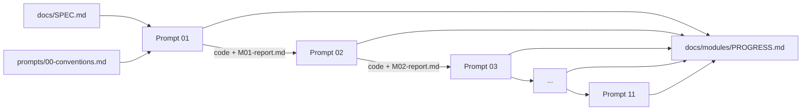

# Module Prompt Collection — AI Recipe-to-Blog

The full spec (`docs/SPEC.md`) is split into **11 buildable modules**. Each module has **one prompt**. Run them **in order**, one per session (or one after another in the same session).

## How context flows between prompts



Each prompt:

1. **Intake:** reads `docs/SPEC.md`, `prompts/00-conventions.md`, `docs/modules/PROGRESS.md` and the reports of the modules it depends on, then inspects the code those modules produced.
2. **Baseline:** runs the existing test suite *before* changing anything. If the baseline is red, it fixes that first and records the fix.
3. **Builds** only its own scope.
4. **Module tests:** unit tests for the new code.
5. **Integration tests:** tests that exercise the new module together with the modules it connects to (listed per prompt).
6. **Regression:** runs the whole suite plus lint/type checks.
7. **Handoff:** writes `docs/modules/MXX-report.md` (template: `HANDOFF_TEMPLATE.md`) with the real test output, and updates `PROGRESS.md`. **The next prompt reads this.**

So "context from the previous prompt, generated code, and test results" lives in the repo, not in chat history. That means you can run each prompt in a fresh session.

## Module map

| # | Prompt | Builds | SPEC phases | Depends on | Integration tested with |
|---|--------|--------|------------|------------|-------------------------|
| 01 | `01-backend-foundation.md` | FastAPI app, config, logging, errors, DB, all models, initial Alembic migration | P1 | — | DB + migrations + app boot |
| 02 | `02-storage-and-media.md` | StorageService (Local/S3), media validation, FFmpeg probe/extract | P3 | 01 | models (MediaAsset), config |
| 03 | `03-recipe-api.md` | Upload + recipe CRUD + job read APIs, auth dependency, rate limit, media route | P2 | 01, 02 | DB + storage + validation via HTTP |
| 04 | `04-ai-provider.md` | AIProvider, GeminiProvider (LangChain), FakeAIProvider, prompts, schemas, transcription | P4 | 01 | config, schemas, storage (reading audio) |
| 05 | `05-workflow-and-worker.md` | LangGraph state/graph/core nodes, Celery worker, `/process`, job progress, idempotent save | P4 | 01–04 | API → queue → graph → DB |
| 06 | `06-images.md` | ImageSearchProvider (Wikimedia/Unsplash/Pexels), ingredient images, cooking-photo matching, manual assignment API | P5 | 02, 04, 05 | graph nodes + DB + API |
| 07 | `07-blog-and-seo.md` | Blog generation, placeholders, sanitization, SEO, JSON-LD, embeds, blog/publish APIs | P6 | 03–06 | full workflow → blog → public endpoint |
| 08 | `08-similar-recipes.md` | PostgreSQL similarity, graph node, `/similar` endpoint | P8 | 05, 07 | graph + blog API |
| 09 | `09-frontend-foundation-upload.md` | Vite/React scaffold, API client, types, Home, Create, Processing pages | P7 | 03, 05, 08 | real backend with fake AI |
| 10 | `10-frontend-editor-blog.md` | Editor, image picker, preview, public blog, similar cards, SEO preview, server-rendered `/blog/{slug}` + sitemap | P7 | 06–09 | real backend with fake AI |
| 11 | `11-docker-hardening-release.md` | docker-compose, Dockerfiles, security hardening, README, E2E smoke, SPEC §52 checklist | P9, P10 | all | whole stack in Docker |

Phase 9 (testing) isn't a separate module. **Every** module ships its own tests, and module 11 adds the end-to-end checks.

## How to run a prompt

In Claude Code, from the repo root:

```text
Read prompts/0X-<name>.md and execute it exactly.
```

Or paste the prompt file's contents. When a module finishes, check its `docs/modules/MXX-report.md` before you start the next one. If the report lists **blocking** issues, re-run the same prompt with: `Resume module XX — fix the blocking issues in docs/modules/MXX-report.md.`

## Files

- `00-conventions.md` — rules that every module must follow (read by every prompt)
- `01..11-*.md` — module prompts
- `HANDOFF_TEMPLATE.md` — the report format every module must produce
